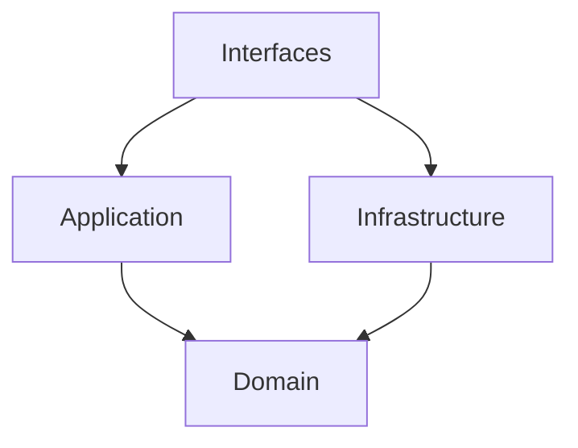

# アーキテクチャ設計 (ARCHITECTURE.md)

## 1\. はじめに

本ドキュメントは、プロジェクトの技術的な設計思想とアーキテクチャについて記述します。
ここでの決定事項は、アプリケーションの**保守性**、**拡張性**、**テスト容易性**を長期的に確保することを目的とします。

## 2\. サーバーサイドアーキテクチャ

サーバーサイドでは、**ドメイン駆動設計 (DDD)** の思想を取り入れた **クリーンアーキテクチャ** を採用しています。これにより、ビジネスロジック（ドメイン）をアプリケーションの他の部分から分離し、関心事の分離を徹底します。

### 2.1. 依存関係のルール

依存関係は、常に外側のレイヤーから内側のレイヤーへと一方向に向かいます。内側のレイヤーは、外側のレイヤーについて一切関知しません。

_(Interfaces層はApplication層を利用し、Application層とInfrastructure層はDomain層を利用します)_

### 2.2. レイヤーの責務

プロジェクトは以下の4つの主要なレイヤーに分割されています。

- **`domain`**: ビジネスの中核となるルールと状態を持つエンティティ層です。
  - **責務**: アプリケーション固有のビジネスルールをカプセル化します。
  - **例**: `Room`エンティティの不変条件（満員でないか、ルーム名が妥当かなど）の維持。

- **`application`**: ユースケース層とも呼ばれ、ユーザーの操作を具体的な処理フローとして調整します。
  - **責務**: `domain`層のエンティティや`infrastructure`層のサービスを組み合わせて、特定のビジネスユースケースを実現します。
  - **例**: `LobbyService`が`Room`エンティティを生成・管理し、ロビー全体のロジックを担う。 `AuthenticateUserUseCase`が認証処理を実行する。

- **`infrastructure`**: データベースや外部APIなど、アプリケーションの外部にある技術的な要素を扱います。
  - **責務**: 外部サービスとの通信やデータ永続化の具体的な実装を担当します。
  - **例**: Firebase Admin SDKを利用したIDトークンの検証を行う`FirebaseAuthService`。

- **`interfaces`**: 外部からの入力を受け取り、結果を外部に出力するためのアダプター層です。
  - **責務**: Socket.IOのイベントハンドリングやミドルウェアなど、外部とのインターフェースを定義します。
  - **例**: Socket.IOの接続時に認証を行う`authMiddleware`、クライアントのイベントを処理する`LobbyHandler`。

## 3\. クライアントサイドアーキテクチャ

クライアントサイド（React）では、**Feature-Sliced Design (FSD)** の採用を推奨します。これは、サーバーサイドのクリーンアーキテクチャと同様に、関心事の分離とスケーラビリティを重視した設計手法です。

### 3.1. 基本方針

- **レイヤー化**: アプリケーションを `app`, `pages`, `widgets`, `features`, `entities`, `shared` の6つのレイヤーに分割し、依存関係を一方向に保ちます。
- **ビジネスドメインによる分割 (スライス)**: 各レイヤーを、`user`や`room`といったビジネスドメイン（スライス）でさらに分割し、コードの凝集度を高めます。

### 3.2. コンポーネント設計

コンポーネントの粒度と再利用性を管理するために、**Atomic Design** の考え方を取り入れます。
FSDのレイヤーと組み合わせることで、一貫性のあるUIライブラリを構築します。

## 4\. `shared` パッケージの役割

モノレポの中心には`packages/shared`ディレクトリが存在します。

- **責務**: クライアントとサーバー間で共有されるコード（DTO、バリデーションスキーマ、型定義など）を管理します。
- **目的**: フロントエンドとバックエンド間の通信における**型安全**を保証し、仕様の齟齬を防ぎます。
