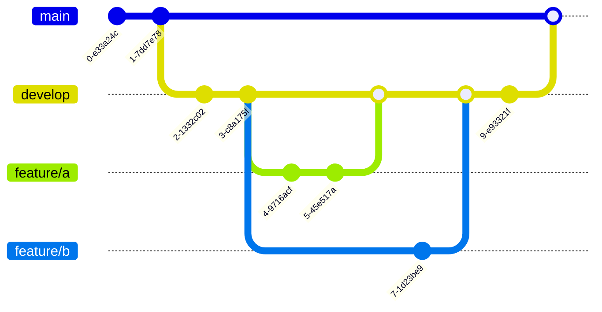

# 貢献ガイド (CONTRIBUTING.md)

このプロジェクトへの貢献に感謝します！
品質と一貫性を保つため、開発に参加する際は以下のガイドラインに従ってください。

## 開発フロー

本プロジェクトでは、**Git Flow** を採用しています。

- **`main`**: リリース専用ブランチです。このブランチへの直接のコミットは禁止します。
- **`develop`**: 開発のベースとなるブランチです。機能開発が完了したら、このブランチへプルリクエストを作成します。
- **`feature/some-feature-name`**: 新しい機能を開発するためのブランチです。`develop`ブランチから作成してください。



## ブランチ命名規則

`feature/` の後には、実装する機能が簡潔にわかるような名前を英語（ケバブケース）で記述してください。

**良い例:**

- `feature/server-room-logic`
- `feature/client-lobby-ui`
- `feature/fix-auth-bug`

**悪い例:**

- `feature/update` (何をしたか不明)
- `feature/kinou_tsuika` (日本語は避ける)

## コミットメッセージのガイドライン

コミットメッセージは、後から変更履歴を追いやすくするための重要な情報です。
以下のフォーマットに従って記述してください。

**フォーマット:** `[コミット種別]: 変更の要約`

- **コミット種別:**
  - `add`: 新規ファイルや機能の追加
  - `update`: 既存機能の修正・変更（バグではない）
  - `fix`: バグ修正
  - `remove`: ファイルや機能の削除
  - `docs`: ドキュメントの追加・修正
- **変更の要約:**
  - 日本語で簡潔に記述します。
  - 体言止めで終わるのが望ましいです。（例: `〜を追加`、`〜を修正`）

**コミットメッセージの例:**

```
add: Roomエンティティと関連テストを追加
fix: 退出したユーザーがロビーに残るバグを修正
docs: 貢献ガイド（CONTRIBUTING.md）を作成
```

## プルリクエストの作成

`feature`ブランチでの開発が完了したら、`develop`ブランチへのプルリクエストを作成します。

- プルリクエストのタイトルには、実装した機能の概要を分かりやすく記述してください。
- 説明文には、どのような変更を行ったか、関連するIssue番号などを記述します。
- CI（Lint, テスト）がすべて成功していることを確認してから、レビューを依頼してください。

## コーディングルール

### ドキュメンテーションコメント

**サーバーサイド**のコードにおいて、`class`や`method`には必ずその役割を説明するドキュメンテーションコメントを記述してください。

- 文体は「**～します。**」で統一します。

**例:**

```typescript
/**
 * 既存のルームにプレイヤーを参加させます。
 * @param user 参加するユーザー
 * @param roomNumber 参加するルームの番号
 * @returns 参加後のRoomインスタンス
 */
public joinRoom(user: User, roomNumber: number): Room {
    // ...
}
```
